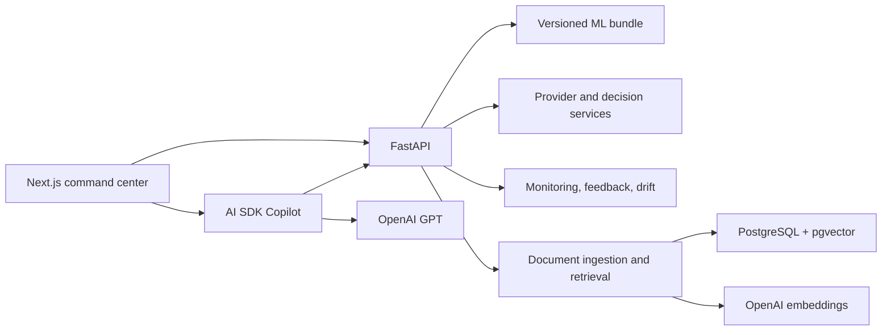

# FloodLens Presentation Slide Content

## How to Use This Document

This is presentation-ready content for a 12-15 minute technical and product
pitch followed by a live demo and viva. Keep slides visually restrained: one
message per slide, short text, real dashboard screenshots, and architecture or
workflow diagrams instead of decorative graphics.

Status labels used in the presentation:

- **Live**: demonstrated from the current application.
- **In verification**: implementation exists and the final deployed flow is
  being validated.
- **Production roadmap**: post-hackathon operationalization.

Do not present seed data, corrected map coordinates, or planned real-time feeds
as verified production data.

---

## Slide 1 - FloodLens

### On-slide content

**FloodLens**

Flood-risk intelligence, operational prioritization, and MLOps for Sri Lanka

**Predict. Prioritize. Explain. Monitor. Learn.**

### Suggested visual

A full-width screenshot of District Command or Risk Explorer with the product
name over a quiet dark area. Do not use a generic flood stock image as the main
visual.

### Speaker notes

FloodLens is not only a prediction model. It is a production-shaped decision
support platform that turns flood-risk evidence into district priorities,
location-level actions, model-health signals, and grounded operational briefs.

---

## Slide 2 - The Operational Gap

### On-slide content

**A risk score is not an operational decision.**

- Data lives across spreadsheets, maps, models, and reports.
- Teams must manually decide which places require attention first.
- Model versions, feedback, and drift are rarely visible to decision makers.
- Response procedures are disconnected from current risk evidence.

### Suggested visual

Simple left-to-right fragmentation diagram:

```text
CSV + model + map + SOP + field report -> manual interpretation -> delayed action
```

### Speaker notes

The technical challenge is not just predicting flood risk. The business
challenge is translating prediction into a defensible worklist while keeping
the model observable and accountable.

---

## Slide 3 - Our Solution

### On-slide content

**One operating layer for flood-risk decisions**

1. Estimate location risk.
2. Compare districts and exposed places.
3. Rank emergency review priorities.
4. Explain drivers and recommended actions.
5. Capture feedback and observed outcomes.
6. Monitor drift and retraining signals.
7. Generate grounded briefs with the Intelligent Copilot.

### Suggested visual

Circular operating-loop diagram showing Prediction -> Priority -> Action ->
Feedback -> Monitoring -> Retraining.

### Speaker notes

FloodLens closes the loop between model engineering and operational use. Every
capability is connected to a concrete user decision.

---

## Slide 4 - Who Uses FloodLens?

### On-slide content

| User | Primary decision |
| --- | --- |
| Emergency coordinator | Which places should be reviewed first? |
| District planner | Where should limited resources be allocated? |
| Infrastructure operator | Which facilities or routes are exposed? |
| Insurer | Which portfolio locations need assessment? |
| MLOps/model team | Is the deployed model still reliable? |

### Suggested visual

Five compact role rows with icons. Avoid persona cards with long paragraphs.

### Speaker notes

The common need across these users is prioritization with evidence. FloodLens
does not replace their authority; it improves the consistency and speed of
their analysis.

---

## Slide 5 - Product Workflow

### On-slide content

```text
Monitored places
  -> Baseline and ML risk
  -> District comparison
  -> Emergency priority queue
  -> Human review and feedback
  -> Monitoring and retraining signal
  -> Grounded action brief
```

### Suggested visual

Use screenshots connected by a single workflow line:

- Risk Explorer
- District Command
- Priority Queue
- Monitoring
- Intelligent Copilot

### Speaker notes

The experience starts with portfolio-level awareness, moves into location-level
investigation, and ends with a reviewed recommendation and lifecycle feedback.

---

## Slide 6 - ML Engineering

### On-slide content

**Reproducible stacked ensemble**

- 18,949 training rows
- 65 model features
- 10-fold stratified cross-validation
- LightGBM + XGBoost + CatBoost
- Ridge stacking meta-learner
- Leakage-safe target encoding
- Versioned inference bundle

**Validation**

- OOF MAE: **0.176789**
- OOF RMSE: **0.231534**

### Suggested visual

Training pipeline diagram with the three base models feeding the Ridge
meta-learner. Show the two validation metrics prominently.

### Speaker notes

The artifact is not a pickled submission. It contains fold models, preprocessing
contracts, the fitted encoder, medians, feature order, configuration, and model
metadata required for repeatable inference.

---

## Slide 7 - Feature and Validation Strategy

### On-slide content

**Feature groups**

- rainfall, drainage, elevation, river distance;
- terrain and extreme-weather interactions;
- infrastructure and evacuation access;
- missingness indicators;
- seasonal signals;
- categorical target encoding;
- train-only district risk statistics.

**Validation discipline**

- out-of-fold encoding;
- 10 stratified folds;
- fold-level MAE;
- OOF ensemble evaluation;
- output clipping and schema tests.

### Suggested visual

Two-column feature/validation diagram. Keep feature names representative rather
than listing all 65.

### Speaker notes

We use out-of-fold transformations to reduce leakage. For production, the next
evaluation upgrade is a time-based and geographically held-out validation set
using verified outcomes.

---

## Slide 8 - System Architecture

### On-slide content



### Supporting labels

- deterministic services own facts and scores;
- the LLM retrieves and synthesizes evidence;
- provider contracts decouple the product from seed CSV data.

### Speaker notes

Next.js owns the product experience and GPT streaming. FastAPI owns ML,
decision logic, monitoring, and document retrieval. This boundary prevents the
LLM from becoming the source of operational truth.

---

## Slide 9 - From Score to Decision

### On-slide content

**FloodLens separates four signals**

| Signal | Purpose |
| --- | --- |
| Baseline risk | Transparent, immediate contextual estimate |
| Model-assisted risk | Ensemble prediction from complete features |
| Operational priority | Risk plus exposure and response difficulty |
| Copilot brief | Evidence synthesis for human review |

Priority considers population exposure, evacuation distance, historical floods,
and infrastructure weakness.

### Suggested visual

Use one real location inspector screenshot with annotations pointing to baseline,
model score, drivers, priority, and action.

### Speaker notes

This separation prevents model risk from being misrepresented as an evacuation
order. A high-risk score and a high operational priority are related but not
identical.

---

## Slide 10 - MLOps Lifecycle

### On-slide content

**The model remains observable after deployment**

- single and bounded batch inference;
- prediction source and model-version logging;
- latest score per monitored place;
- risk-distribution monitoring;
- useful/not-useful feedback;
- observed flood/no-flood outcomes;
- disagreement detection;
- feature and district shift warnings;
- retraining-candidate signal.

### Suggested visual

Model lifecycle loop with screenshots from Monitoring and feedback controls.

### Speaker notes

Five or more feedback records with at least 30% outcome disagreement can flag a
retraining candidate. Drift thresholds independently generate watch or
retraining signals. These signals support review; they do not automatically
deploy a new model.

---

## Slide 11 - Intelligent Copilot

### On-slide content

**GPT-powered, but grounded in FloodLens tools**

Supported questions:

- Which districts need attention first?
- Why is record F104559 risky?
- Compare Colombo and Kalutara.
- Is retraining needed?
- Generate a district action brief.

Guardrails:

- tools before operational answers;
- sources shown as evidence;
- no invented live weather or official warning;
- decision support, not emergency authority.

### Suggested visual

Real Copilot screenshot showing a tool call and grounded response. Keep one
collapsed evidence panel visible.

### Speaker notes

The Copilot does not calculate flood risk itself. It calls deterministic APIs,
then explains and combines the returned evidence. This makes it useful without
allowing the LLM to replace the model or monitoring system.

---

## Slide 12 - Document Intelligence and RAG

### On-slide content

**Connect approved response knowledge to current risk evidence**

```text
Upload SOP / policy / field report
  -> validate and extract
  -> token-aware chunks
  -> OpenAI embeddings
  -> PostgreSQL + pgvector
  -> hybrid semantic + keyword retrieval
  -> page-level citations in Copilot answers
```

**Current status:** local end-to-end implementation includes the Knowledge
Library, hybrid retrieval, Copilot search tool, and page-level citations.

### Suggested visual

Document ingestion and retrieval sequence with one example citation card.

### Speaker notes

RAG does not produce the model score. It retrieves approved operational
knowledge. The final Copilot combines that knowledge with FloodLens model,
priority, feedback, and drift tools.

---

## Slide 13 - Production Readiness

### On-slide content

**Implemented evidence**

- versioned artifact and metadata;
- reusable training and inference code;
- FastAPI serving and bounded batch scoring;
- provider abstraction;
- prediction, feedback, and drift monitoring;
- ML and backend regression tests;
- frontend lint and production build;
- Docker and CI foundations.

**Final hardening**

- full frontend/backend/pgvector Compose stack;
- complete CI jobs and migration checks;
- durable task queue and object storage;
- authentication, authorization, and audit logs;
- centralized metrics and tracing.

### Suggested visual

Readiness checklist with implemented and final-hardening columns.

### Speaker notes

For the hackathon, file-based operational logs make the behavior transparent
and easy to demonstrate. Production replaces them with transactional storage
and durable event processing.

---

## Slide 14 - Business Value

### On-slide content

**From fragmented analysis to one defensible workflow**

- Faster district and portfolio assessment
- Consistent location prioritization
- Clear reasons and recommended next actions
- Evidence trail across model version, score, feedback, and sources
- Closed loop from field outcome to retraining decision
- Extensible to government, infrastructure, insurance, and logistics assets

### Suggested visual

Before/after comparison:

```text
Before: spreadsheets + maps + reports + manual summary
After: ranked portfolio + model evidence + monitoring + cited action brief
```

### Speaker notes

The strongest business value is not a claim of preventing floods. It is reducing
the time and inconsistency involved in preparing and defending operational
decisions.

---

## Slide 15 - Innovation and Engineering Trade-offs

### On-slide content

**Innovation**

- combines predictive ML, operational prioritization, MLOps, and grounded AI;
- keeps baseline, model risk, priority, and Copilot synthesis distinct;
- uses feedback and observed outcomes as lifecycle signals;
- hybrid document retrieval joins operational SOPs with live system evidence.

**Pragmatic trade-offs**

- seed provider now, replaceable providers later;
- JSONL for transparent prototype monitoring, database for production;
- bounded local batches, async workers for scale;
- corrected presentation coordinates, verified geospatial data for deployment.

### Speaker notes

The architecture is intentionally production-shaped without pretending every
production integration already exists. Each prototype choice has a documented
upgrade path.

---

## Slide 16 - Roadmap and Closing

### On-slide content

**Complete**

- predictive ML and artifact export;
- FastAPI serving and decision intelligence;
- interactive command center;
- batch scoring, monitoring, feedback, and drift;
- tool-grounded Intelligent Copilot.

**Before final submission**

- verify the cited RAG flow against the deployed pgvector environment;
- add retrieval-quality evaluation evidence;
- complete Docker Compose and CI/CD;
- end-to-end telemetry and deployment verification;
- final demo data, evaluation evidence, and rehearsal.

**FloodLens turns flood-risk prediction into a monitored, explainable, and
action-oriented decision workflow.**

### Suggested visual

Product architecture fading into the closing statement. Keep the team names and
repository/demo QR code in a small footer.

### Speaker notes

Our contribution is the complete system around the model: reproducible ML,
operational decisions, lifecycle monitoring, human feedback, and grounded
intelligence. That is what makes FloodLens an MLOps product rather than a model
demo.

---

# Live Demo Script

## Five-minute sequence

### 0:00-0:30 - Overview

Show:

- API health;
- active `flood-risk-v3` model;
- feature count and validation metrics;
- current prediction activity.

Say:

> The deployed service loads a versioned ensemble artifact once and exposes its
> operational and validation metadata.

### 0:30-1:20 - Risk Explorer

Show:

- district filter;
- synchronized Sri Lanka map and table;
- one selected location;
- baseline risk, drivers, priority, and action;
- corrected coordinate-source label.

Say:

> This is provider-backed seed data. We preserve raw coordinates and clearly
> label corrected presentation coordinates rather than hiding data quality.

### 1:20-2:10 - District Command and batch scoring

Show:

- district ranking;
- high-risk and priority counts;
- run batch scoring for a bounded district sample;
- baseline versus latest model score.

Say:

> The backend scores the records in one DataFrame batch, logs each model-versioned
> event, and persists the latest score for decision views.

### 2:10-2:55 - Feedback and monitoring

Show:

- submit usefulness feedback and an observed outcome;
- monitoring summary;
- disagreement and drift state;
- retraining-candidate status.

Say:

> Operational outcomes return to the model lifecycle. Retraining is evidence
> driven rather than scheduled blindly.

### 2:55-4:00 - Intelligent Copilot

Ask:

> Which districts need attention first, and what evidence supports that?

Then ask:

> Is retraining needed based on current feedback and drift?

Show the tool evidence panels.

Say:

> GPT does not invent the answer. The agent calls FloodLens tools and synthesizes
> deterministic evidence. It is explicitly blocked from claiming official
> warnings or evacuation authority.

### 4:00-4:40 - Document RAG

When fully integrated, show:

- upload one approved SOP;
- indexing status;
- ask for an action brief;
- open one page-level citation.

If the deployed pgvector environment is not verified before presenting, show
this as a local implementation and state the limitation directly.

### 4:40-5:00 - Close

Say:

> FloodLens closes the loop from data and model training to scoring, priority,
> human feedback, drift monitoring, retraining evidence, and grounded action.

---

# Viva Preparation

## Why use an ensemble?

LightGBM, XGBoost, and CatBoost have different inductive biases and categorical
handling behavior. Out-of-fold predictions feed a Ridge meta-learner, allowing
the final model to learn a stable weighted combination rather than relying on a
manual average.

## How do you prevent target leakage?

Categorical target encodings are computed out-of-fold for training rows. The
full training mapping is only used for inference data. District risk statistics
are derived from training targets and exported for inference.

## Why MAE and RMSE?

MAE provides an interpretable average absolute error and is robust for the core
regression objective. RMSE adds sensitivity to larger errors. Together they
show typical error and penalty for larger misses.

## Why is baseline risk separate from model risk?

The baseline is a transparent business heuristic available before model
scoring. The model uses the full feature contract. Keeping labels and values
separate prevents heuristic output from being presented as ML and gives users a
useful disagreement signal.

## Why is emergency priority not simply the highest model score?

Response priority must consider consequence and operational difficulty.
Population exposure, evacuation access, history, and infrastructure weakness
may make a medium-risk location more urgent to review than an isolated
high-risk location.

## How does retraining work?

The current system produces a retraining-candidate signal from feature/risk
distribution shifts or sustained disagreement with observed outcomes. A human
reviews data quality and labels before triggering the reproducible training
pipeline. Production would automate orchestration, evaluation gates, registry
promotion, canary deployment, and rollback.

## Why use JSONL instead of a database for prediction logs?

JSONL is transparent, low-dependency, and sufficient for the prototype. It
makes events easy to inspect during judging. It is not the scale target;
production uses transactional or event-stream storage.

## Why does the LLM run in Next.js while ML runs in FastAPI?

Next.js and AI SDK provide streaming chat and typed tool rendering. FastAPI
already owns Python ML, data providers, monitoring, and retrieval. This keeps
the LLM orchestration separate from deterministic operational facts.

## Why use pgvector and full-text search together?

Semantic search captures meaning while PostgreSQL full-text search recovers
exact terms, codes, and policy language. Reciprocal-rank fusion combines both
result lists without requiring their raw scores to share a scale.

## What happens if OpenAI is unavailable?

Core risk exploration, prediction, prioritization, monitoring, feedback, and
drift remain deterministic and available. Copilot generation and document
embedding/search return clear dependency errors. Production should add retries,
timeouts, rate limiting, caching, and provider contingency planning.

## What if live rainfall data becomes available?

Add a verified weather/hydrology provider with timestamps, validation, and
freshness monitoring. Preserve the existing provider contract, extend the
feature pipeline, retrain using time-aware validation, and show data freshness
in every decision surface.

## Can this scale beyond 100 records?

Yes. The current limit protects the local synchronous demo. Production changes
batch scoring to a queued job, partitions workloads, stores results in a
database, and scales stateless workers horizontally.

## Is FloodLens an official warning system?

No. It is decision support. Official alerts require verified real-time feeds,
defined authority, validation, governance, and human approval workflows.

---

# Screenshot Checklist

Capture these at a consistent desktop viewport with real application data:

1. Overview with model/API status.
2. Risk Explorer map and selected-location inspector.
3. District Command before and after batch scoring.
4. Priority Queue with reasons and actions.
5. Monitoring with feedback and drift.
6. Copilot answer with visible tool evidence.
7. Knowledge Library upload/index/citation flow.

Avoid screenshots with clipped tables, stale loading states, offshore points,
empty values without labels, exposed secrets, browser developer tools, or
unverified claims.
