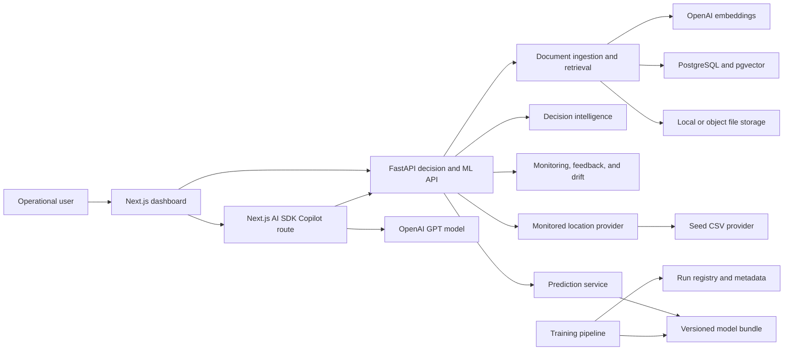
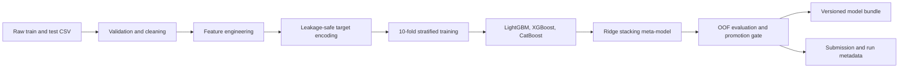
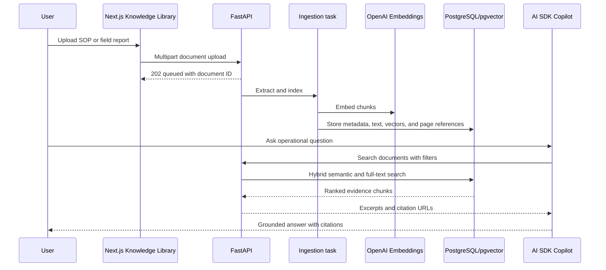

# FloodLens Technical Architecture and MLOps Document

## Document Purpose

This document describes the complete technical design of FloodLens, the current
implementation, and the target architecture for the final hackathon submission.
It is written for technical judges, engineers, reviewers, and team members who
need to understand how data moves from ingestion through training, inference,
decision intelligence, monitoring, feedback, drift detection, and the
grounded Copilot.

Status terminology used throughout this document:

- **Implemented**: present and working in the repository.
- **Foundation implemented**: core backend or architectural work exists, but
  the full user workflow is not connected yet.
- **Planned before final submission**: committed scope that remains to be
  completed and verified.

## 1. System Objective

FloodLens is a production-shaped flood-risk decision-support platform for Sri
Lanka. Its technical objective is to convert environmental and geographic
features into repeatable risk scores, district-level priorities, traceable
operational recommendations, model-health signals, and grounded natural-language
briefs.

The system is intentionally separated into four concerns:

1. **Predictive ML** estimates flood-risk scores.
2. **Decision intelligence** converts model and contextual signals into ranked
   operational priorities.
3. **MLOps services** track serving activity, feedback, drift, model versions,
   and retraining signals.
4. **Intelligent Copilot and document retrieval** translate structured evidence
   and response documents into concise, cited decision support.

FloodLens does not claim to be an official emergency warning or evacuation
authority. Live operational use requires verified government, weather,
hydrology, satellite, and asset feeds.

## 2. Architecture Overview



### Service ownership

| Layer | Responsibility | Technology | Status |
| --- | --- | --- | --- |
| Frontend | Operational dashboard, map, tables, feedback, Copilot UI | Next.js 16, React 19, TypeScript, Tailwind, shadcn, MapLibre | Implemented |
| Copilot orchestration | Streaming, tool loop, safety instructions, evidence rendering | Vercel AI SDK, AI Elements, direct OpenAI provider | Implemented |
| Backend | Model serving, providers, ranking, monitoring, feedback, drift, document APIs | FastAPI, Pydantic, pandas | Implemented |
| ML | Data validation, feature engineering, training, evaluation, export, inference | Python, LightGBM, XGBoost, CatBoost, scikit-learn | Implemented |
| Operational persistence | Prediction events, latest scores, feedback | JSONL and JSON | Implemented for prototype |
| RAG persistence | Document metadata, chunks, vectors, full-text index | PostgreSQL, pgvector, SQLAlchemy, Alembic | Implemented locally |
| File storage | Uploaded source documents | Local storage initially; S3-compatible target | Implemented locally |
| Automation | Test and build gates | GitHub Actions, Docker Compose | Partially implemented |

## 3. Repository Structure

```text
floodly/
  artifacts/flood-risk-v3/       Versioned deployable model bundle and metadata
  backend/
    app/api/                     Prediction, decision, monitoring, and document APIs
    app/core/                    Settings and repository path resolution
    app/db/                      SQLAlchemy engine and PostgreSQL models
    app/services/                Domain services and provider implementations
    alembic/                     Database migrations for document RAG
    tests/                       FastAPI and service regression tests
  data/raw/                      Seed training and test datasets
  frontend/
    app/                         Next.js dashboard and Copilot streaming route
    components/dashboard/        Operational product views
    components/ai-elements/      Streaming AI interface primitives
    lib/                         Typed API, document, and Copilot clients
  ml/
    configs/                     Versioned training configuration
    pipelines/                   Train, batch, and export entry points
    src/                         Data, feature, model, evaluation, inference modules
    tests/                       Pipeline and inference tests
  docs/                          Architecture, product, setup, and presentation material
  infra/                         Container orchestration
  .github/workflows/             Continuous integration
```

## 4. Data and Provider Architecture

### Current source

The current monitored-location source is the competition `test.csv`. It is
treated as a seed provider rather than a permanent product dependency.

`MonitoredLocationProvider` defines the stable backend contract:

```python
class MonitoredLocationProvider:
    def districts(self) -> list[str]: ...
    def locations(self, district=None, search=None, limit=250) -> list[dict]: ...
    def record(self, record_id: str) -> dict: ...
```

`SeedCsvLocationProvider` currently implements the contract. Future providers
can load database assets, uploaded asset portfolios, weather feeds, hydrology
feeds, or verified government datasets without changing the frontend and
decision services.

### Coordinate handling

The raw seed coordinates contain records that are unsuitable for trustworthy
map presentation. FloodLens preserves the original values for auditability and
uses deterministic district-centroid presentation coordinates for the demo map.
The UI and API label the coordinate source. Final operational deployment must
replace these values with verified asset or field coordinates.

### Target production entities

- `MonitoredAsset`: community, hospital, school, road, warehouse, property, or
  other exposed asset.
- `Observation`: rainfall, river level, drainage condition, flood report, or
  verified outcome at a point in time.
- `Prediction`: model score, risk level, model version, feature timestamp, and
  inference source.
- `DecisionPriority`: ranked operational score, reasons, action, and review
  state.
- `FeedbackEvent`: usefulness rating, observed outcome, disagreement, and notes.
- `Document`: SOP, policy, field report, or operational guidance source.

## 5. ML Training Pipeline

### End-to-end workflow



### Data preparation

The pipeline performs:

- corrupted-row handling using the synthetic-data marker;
- deduplication by `record_id`;
- duplicate target averaging when configured;
- train/test schema validation;
- processed Parquet caching;
- deterministic configuration and random seeds.

### Feature engineering

The current exported model uses 65 engineered and encoded features. Major
feature groups include:

- text-derived reason flags for flood, infrastructure, and road conditions;
- binary encodings for water presence, current flood occurrence, habitability,
  and urban/rural class;
- missingness indicators for environmental and infrastructure measurements;
- seasonal month, sine, and cosine features;
- rainfall-drainage, elevation-river, terrain-weather, and extreme-rainfall
  interactions;
- train-only district risk statistics;
- smoothed target encoding for categorical variables;
- median imputation learned from training data.

Target encoding is generated out-of-fold during training to reduce leakage.
Inference reuses the fitted encoder, raw column order, categorical columns,
feature order, and training medians saved in the artifact.

### Model ensemble

FloodLens trains three gradient-boosting regressors:

- LightGBM with Huber objective;
- XGBoost with pseudo-Huber objective;
- CatBoost with MAE objective.

Each model is trained across 10 stratified folds. Their out-of-fold predictions
become inputs to a Ridge meta-learner. The final score is clipped to `[0, 1]`.

Risk bands are:

- `Low`: score below `0.33`;
- `Medium`: score from `0.33` to below `0.66`;
- `High`: score of at least `0.66`.

### Exported model evidence

Current artifact metadata:

| Property | Value |
| --- | ---: |
| Model version | `flood-risk-v3` |
| Training rows | 18,949 |
| Features | 65 |
| CV folds | 10 |
| OOF MAE | 0.176789 |
| OOF RMSE | 0.231534 |
| Training time | 479.6 seconds |
| Base model order | LightGBM, XGBoost, CatBoost |

The artifact contains fold models, Ridge meta-model, target encoder, feature
column contracts, medians, district statistics, configuration snapshot, and
model metadata. FastAPI imports the reusable inference implementation rather
than duplicating model preprocessing.

### Current evaluation limitations

- The current split is stratified cross-validation over the supplied dataset,
  not a true time-based or geographically held-out production evaluation.
- The score range in the exported test predictions is relatively narrow and
  should be checked during calibration work.
- Final operational validation requires verified observed flood outcomes.
- Fairness and performance should be evaluated by district, asset type, season,
  and data-source quality before real deployment.

## 6. Inference and Decision Intelligence

### Model serving

`PredictorService` loads the model bundle once and supports:

- single-record inference through `POST /predict`;
- vectorized batch inference through `POST /batch-predict`;
- model metadata through `GET /model-info`;
- service readiness through `GET /health`.

Batch requests are capped at 100 records in the prototype to provide predictable
local-demo latency and resource use.

### Baseline versus model-assisted risk

FloodLens deliberately distinguishes two concepts:

- **Baseline risk** is a transparent business heuristic calculated from visible
  environmental and exposure variables. It supports immediate ranking before
  an ML score exists.
- **Model-assisted risk** is the ensemble prediction produced from the complete
  feature contract.

Showing both prevents the interface from silently presenting a heuristic as an
ML output. Disagreement between them is a review signal, not automatically an
error.

### Emergency priority

Risk is not the same as response priority. The decision layer combines flood
risk with population exposure, evacuation distance, historical flood count,
and infrastructure weakness. It returns a ranked emergency-priority score,
human-readable reasons, and a recommended action.

This score is decision support and must not be represented as an official
evacuation order.

### Decision APIs

| Endpoint | Purpose |
| --- | --- |
| `GET /districts` | Available district filters |
| `GET /locations` | Search and browse monitored places |
| `GET /locations/{id}/record` | Full provider record for scoring and evidence |
| `GET /district-summary` | Compare district risk, counts, priorities, and drivers |
| `GET /high-risk-locations` | Rank locations by baseline risk |
| `GET /emergency-priority` | Rank locations by response-planning priority |
| `POST /predict` | Score one complete location record |
| `POST /batch-predict` | Score a district or selected records as one batch |
| `GET /model-scores` | Read latest persisted model-assisted scores |

## 7. MLOps Monitoring and Feedback

### Prediction logging

Successful predictions append compact JSONL events containing timestamp,
source, record ID, district, place, score, risk level, model version, and batch
ID where relevant. Full feature payloads are intentionally not logged in the
prototype.

The monitoring summary reports:

- total, single, and batch predictions;
- number of batch runs and latest batch ID;
- risk-level distribution and average score;
- active model versions;
- latest prediction timestamp;
- most active districts.

### Latest-score store

`latest_scores.json` stores the newest model-assisted result per record. It
supports baseline/model comparison and feedback enrichment without rescoring.
This lightweight store should become a transactional database table in
production.

### Human feedback loop

Users can record:

- whether a prediction was useful;
- observed outcome: flooded, not flooded, or unknown;
- an optional short note.

A disagreement is recorded when:

- observed `flooded` conflicts with model `Low`; or
- observed `not_flooded` conflicts with model `High`.

At least five feedback events and a disagreement rate of 30% or higher produce
a retraining-candidate signal.

### Drift monitoring

The current lightweight drift service compares recent scored locations with
the provider reference distribution. It reports sample size, risk-score shift,
district mix shift, numeric feature warnings, and a recommendation.

Current thresholds:

- fewer than 10 recent records: `insufficient_data`;
- moderate score, district, or feature shift: `watch`;
- larger shift or sustained feedback disagreement: `retraining_candidate`.

This is an operational indicator rather than a full statistical monitoring
platform. Production extensions should add PSI/KS tests, feature schema checks,
latency/error telemetry, model performance after labels arrive, and alerting.

## 8. Intelligent Copilot

### Architecture

The Copilot runs in a Next.js streaming API route using the direct OpenAI
provider. A Vercel AI SDK `ToolLoopAgent` selects typed FloodLens tools and
streams UI messages to AI Elements components.

Available operational tools include model information, district summaries,
high-risk locations, emergency priority, location records, model scores,
monitoring summaries, feedback summaries, and drift summaries.

### Grounding contract

The agent is instructed to:

- call FloodLens tools before answering operational questions;
- distinguish baseline risk, model score, priority, drivers, feedback, and drift;
- identify seed/demo data limitations;
- mention the source labels used;
- refuse to invent live rainfall, verified disaster status, official warnings,
  or evacuation orders;
- provide decision support rather than emergency authority.

### Example multi-tool intent

For “Is retraining needed?”, the agent should combine:

1. model metadata;
2. monitoring/drift status;
3. feedback disagreement rate;
4. recent model-version activity.

The LLM is responsible for synthesis, not for replacing deterministic model and
monitoring services.

## 9. Document RAG Architecture

### Current implementation

The backend currently contains:

- multipart upload, list, summary, file, delete, reindex, and search endpoints;
- PDF, TXT, and Markdown validation;
- SHA-256 duplicate detection;
- local document storage;
- PyMuPDF text extraction;
- token-aware chunks of 800 tokens with 120-token overlap;
- OpenAI `text-embedding-3-small` embeddings with configurable dimensions;
- PostgreSQL models and Alembic migration;
- pgvector HNSW cosine index;
- PostgreSQL full-text GIN index;
- hybrid semantic and lexical retrieval using reciprocal-rank fusion;
- page-level citation URLs and retrieval latency metadata;
- Knowledge Library UI with drag-and-drop upload, per-file progress, filters,
  status polling, reindex, delete, and open-document actions;
- a typed `searchDocuments` Copilot tool;
- page-level citation rendering in Copilot responses;
- extraction, validation, storage, duplicate, chunking, and hybrid-retrieval
  tests.

### Remaining production work

- verify the complete RAG flow in the deployed PostgreSQL/pgvector environment;
- add a retrieval evaluation set and grounded-answer quality gates;
- replace FastAPI `BackgroundTasks` with a durable queue for production;
- add OCR for scanned documents;
- add prompt-injection defenses and document access controls.

### RAG flow



## 10. Frontend and UX Architecture

The frontend is a task-oriented command center rather than a marketing page.
Primary views are:

- **Overview**: service, model, prediction, and portfolio status;
- **Risk Explorer**: synchronized map, table, filters, and location inspector;
- **District Command**: district-level comparison and batch-scoring workflow;
- **Priority Queue**: ranked response-planning locations and reasons;
- **Prediction**: complete-record prediction tester and feedback;
- **Monitoring**: prediction activity, model versions, feedback, drift, and
  retraining state;
- **Intelligent Copilot**: streaming, tool-grounded operational conversation;
- **Knowledge Library**: document upload, lifecycle, filtering, reindexing,
  deletion, and retrieval-to-Copilot workflow.

The map uses MapLibre. Filters and selection state synchronize map markers,
tables, and the inspector. Risk colors are reserved for risk meaning rather
than decoration.

## 11. Security, Reliability, and Governance

### Implemented safeguards

- strict request models where appropriate;
- bounded list and batch sizes;
- document file type, extension, MIME, signature, size, and binary checks;
- SHA-256 duplicate document protection;
- safe generated storage keys;
- no full feature payloads in prediction logs;
- explicit Copilot limitations and evidence requirements;
- health and model metadata endpoints;
- model version recorded with predictions and feedback.

### Required production safeguards

- authentication and role-based access;
- tenant and document-level authorization;
- malware scanning and object-storage signed URLs;
- encryption in transit and at rest;
- secret manager for OpenAI and database credentials;
- request rate limits and API quotas;
- PII classification and retention policy;
- immutable audit logs;
- prompt-injection screening and retrieved-content boundaries;
- verified data-source provenance and freshness timestamps;
- human approval for high-impact recommendations.

## 12. Testing and Quality Gates

Current tests cover:

- data cleaning and validation;
- feature engineering and target encoding;
- output range and submission contract;
- exported-bundle single-row inference;
- API health, metadata, valid and invalid predictions;
- prediction logging and monitoring summaries;
- provider behavior, location search, and coordinate contracts;
- district summaries and priority ranking;
- batch scoring and latest-score persistence;
- feedback validation, disagreement, and retraining signals;
- drift behavior with and without sufficient scored records.

Current local verification targets:

```bash
cd ml && .venv/bin/python -m pytest tests -q
PYTHONPATH=backend ml/.venv/bin/python -m pytest backend/tests -q
cd frontend && pnpm lint && pnpm build
```

CI currently runs the ML test job. The final CI target must also run backend
tests, frontend lint/build, migration checks, and container smoke tests.

## 13. Deployment Target

### Hackathon deployment

- Next.js frontend and Copilot route on a Node-compatible host;
- FastAPI backend in a Python container;
- PostgreSQL with pgvector;
- model artifact supplied through a GitHub Release or mounted artifact volume;
- uploaded documents in a persistent volume for the demo;
- environment-managed OpenAI and database credentials.

### Production evolution

- object storage instead of local uploads;
- durable queue and worker for ingestion and batch scoring;
- managed PostgreSQL/pgvector with backups;
- centralized logs, metrics, and distributed traces;
- autoscaled stateless API and frontend services;
- model registry and artifact store;
- scheduled or event-driven retraining workflow;
- canary deployment and rollback for model versions.

## 14. Engineering Trade-offs

| Decision | Benefit | Limitation | Evolution path |
| --- | --- | --- | --- |
| Seed CSV provider | Fast, reproducible demo | Not live operational data | Database, upload, and verified feed providers |
| JSONL monitoring | Transparent and low setup cost | Weak concurrency and querying | PostgreSQL/event stream |
| Batch limit of 100 | Predictable local performance | Not high-throughput serving | Async jobs and queue workers |
| District-centroid map correction | Prevents visibly invalid offshore points | Not asset-accurate | Verified geocoded coordinates |
| FastAPI BackgroundTasks for RAG | Simple local ingestion | Not durable across restarts | Celery, Redis, or cloud queue |
| Direct OpenAI provider | Simple streaming and embedding integration | External dependency and cost | Cost controls, caching, model abstraction |
| Hybrid RAG retrieval | Better exact-term and semantic recall | Needs evaluation and tuning | Retrieval benchmark and reranking |

## 15. Completion Plan

### Implemented

- reproducible ML training and inference bundle;
- FastAPI single and batch serving;
- provider-backed location and decision intelligence;
- interactive operational dashboard;
- prediction logging and latest scores;
- feedback, drift, and retraining indicators;
- tool-grounded OpenAI Copilot;
- local tests for ML and core backend behavior.

### Implemented RAG layer

- PostgreSQL/pgvector document schema and migration;
- document upload, extraction, embedding, lifecycle, and hybrid retrieval APIs;
- typed frontend document client;
- Knowledge Library dashboard;
- Copilot document-search tool and page-level citation rendering;
- document extraction, validation, storage, and retrieval tests.

### Planned before final submission

- deployed end-to-end RAG verification and retrieval-quality evaluation;
- complete Docker Compose with frontend and pgvector;
- backend/frontend/migration CI jobs;
- final telemetry, demo seed documents, architecture visuals, and rehearsal;
- verified deployment and end-to-end smoke test.

## 16. Technical Judge Summary

FloodLens demonstrates more than model accuracy. It shows an end-to-end ML
system with reproducible training, reusable artifacts, API serving, batch
workloads, provider abstraction, decision intelligence, logging, human
feedback, drift indicators, retraining signals, a grounded tool-using Copilot,
and an actively implemented hybrid RAG foundation. The primary engineering
principle is separation of concerns: deterministic services own facts and
scores, while the LLM only retrieves and synthesizes evidence.
